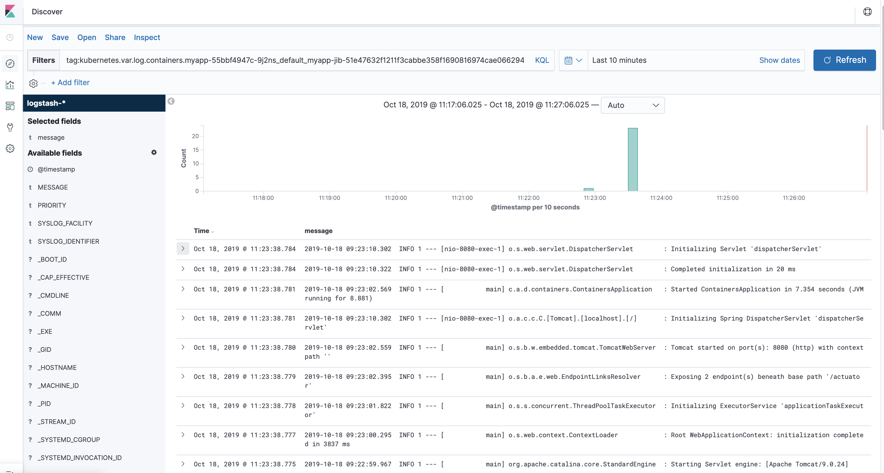

== Kubernetes for the busy developer

The Kubernetes hype train has reached full velocity and many organisations are now adopting the technology.
The Kubernetes ecosystem can be very operator focused and it can be a challenge for developers to distill the information that is relevant for their job.
There are a large number of available tools aimed at solving a broad set of problems but it can be daunting choosing which to invest in.
This tutorial aims to provide developers with a thorough grounding on Kubernetes concepts, suggest best practices and get hands-on with some of the essential tooling.

=== Why this tutorial

After working with a PaaS where the developer has just one single command to deploy the applications: `cf push`, `heroku deploy` or `gcloud app deploy`.
They abstract from a huge amount of complexity.
The experience coming to kubernetes is far from that.
There are many tools for each phase of the lifecycle increasing the learning curve.

=== What this tutorial is not about

* How to operate or deploy a k8s cluster.
* K8s architecture will be treated as a black box and only the necessary will be described.

=== <<containerizing-java/README.adoc#,Building an image from source>>

=== Tagging

We have been tagging our image using the default tag `latest`.
But the same way you would never go to production with `SNAPSHOT` in your dependencies, you will never go with `latest` as your tag.

There are different strategies, the one I like the most is the timestamp one:

```
jib.to.image = 'grc.io/albertoimpl/myapp:' + System.nanoTime()
```

Or on CI you can use the git hash:

```
./gradlew jib --image=grc.io/albertoimpl/myapp:{{github.sha}}
```

=== Registries

In order for our image to be downloaded, we have to upload it somewhere.
Registries are the place where we will upload our images.

The ones we took a look at are:

==== DockerHub

Is the original and most used registry, free for public, paid for private.
They have an on prem offering.

==== GRC/ACR/ECR

Are the biggest cloud providers registries, if you are using their hosted kubernetes container services, you should use their registries.

==== Harbor

Open Source registry started by VMWare, now part of the CNCF. It enables users to have their on prem registry.

=== Deployment

We can get jib to push the image to the registry:

```
 ./gradlew jib --image=albertoimpl/myapp-jib
To honour the JVM settings for this build a new JVM will be forked. Please consider using the daemon: https://docs.gradle.org/5.6.2/userguide/gradle_daemon.html.
Daemon will be stopped at the end of the build stopping after processing

> Task :jib

Containerizing application to albertoimpl/myapp-jib...
The credential helper (docker-credential-desktop) has nothing for server URL: registry-1.docker.io

Got output:

credentials not found in native keychain

The credential helper (docker-credential-desktop) has nothing for server URL: registry.hub.docker.com

Got output:

credentials not found in native keychain


Container entrypoint set to [java, -cp, /app/resources:/app/classes:/app/libs/*, com.albertoimpl.devoxxbe.containers.ContainersApplication]

Built and pushed image as albertoimpl/myapp-jib
Executing tasks:
[==============================] 100.0% complete


BUILD SUCCESSFUL in 34s
3 actionable tasks: 3 executed
```

or by adding the registry to our `build.gradle` file:

```
jib {
	to {
		image = 'albertoimpl/myapp-jib'
	}
}
```

Now that we have a tagged image in a registry, we are ready to deploy it into kubernetes.

=== <<k8s-basics/README.adoc#,K8s basics>>

=== <<local-development-workflow/README.adoc#,Local Development Workflow>>

=== Logs aggregation

We have seen that we can stream our logs locally with Skaffold, and now we are going to show how to do it remotely:

==== Logs from one pod

If there is a problem with our app. If we have one app, getting the logs is easy:

```
k logs pod/myapp-55bbf4947c-4l6lq

  .   ____          _            __ _ _
 /\\ / ___'_ __ _ _(_)_ __  __ _ \ \ \ \
( ( )\___ | '_ | '_| | '_ \/ _` | \ \ \ \
 \\/  ___)| |_)| | | | | || (_| |  ) ) ) )
  '  |____| .__|_| |_|_| |_\__, | / / / /
 =========|_|==============|___/=/_/_/_/
 :: Spring Boot ::        (v2.1.8.RELEASE)

2019-10-18 08:06:19.095  INFO 1 --- [           main] c.a.d.containers.ContainersApplication   : Starting ContainersApplication on myapp-55bbf4947c-4l6lq with PID 1 (/app/classes started by root in /)
2019-10-18 08:06:19.107  INFO 1 --- [           main] c.a.d.containers.ContainersApplication   : No active profile set, falling back to default profiles: default
2019-10-18 08:06:25.271  INFO 1 --- [           main] o.s.b.w.embedded.tomcat.TomcatWebServer  : Tomcat initialized with port(s): 8080 (http)
2019-10-18 08:06:25.501  INFO 1 --- [           main] o.apache.catalina.core.StandardService   : Starting service [Tomcat]
2019-10-18 08:06:25.512  INFO 1 --- [           main] org.apache.catalina.core.StandardEngine  : Starting Servlet engine: [Apache Tomcat/9.0.24]
2019-10-18 08:06:25.927  INFO 1 --- [           main] o.a.c.c.C.[Tomcat].[localhost].[/]       : Initializing Spring embedded WebApplicationContext
2019-10-18 08:06:25.929  INFO 1 --- [           main] o.s.web.context.ContextLoader            : Root WebApplicationContext: initialization completed in 6619 ms
2019-10-18 08:06:28.278  INFO 1 --- [           main] o.s.s.concurrent.ThreadPoolTaskExecutor  : Initializing ExecutorService 'applicationTaskExecutor'
2019-10-18 08:06:29.422  INFO 1 --- [           main] o.s.b.a.e.web.EndpointLinksResolver      : Exposing 2 endpoint(s) beneath base path '/actuator'
2019-10-18 08:06:29.753  INFO 1 --- [           main] o.s.b.w.embedded.tomcat.TomcatWebServer  : Tomcat started on port(s): 8080 (http) with context path ''
2019-10-18 08:06:29.784  INFO 1 --- [           main] c.a.d.containers.ContainersApplication   : Started ContainersApplication in 12.49 seconds (JVM running for 13.595)
2019-10-18 08:06:50.637  INFO 1 --- [nio-8080-exec-1] o.a.c.c.C.[Tomcat].[localhost].[/]       : Initializing Spring DispatcherServlet 'dispatcherServlet'
2019-10-18 08:06:50.638  INFO 1 --- [nio-8080-exec-1] o.s.web.servlet.DispatcherServlet        : Initializing Servlet 'dispatcherServlet'
2019-10-18 08:06:50.655  INFO 1 --- [nio-8080-exec-1] o.s.web.servlet.DispatcherServlet        : Completed initialization in 17 ms
```

==== Logs from all the pods

However,  we are in a microservices world, we could have 10 instances.
What are the odds of us hitting the right pod?

For that I use a tool called stern, you can just brew install it and it will print the logs for each instance in a different color.

```
stern myapp
+ myapp-55bbf4947c-57dcn › myapp-jib
+ myapp-55bbf4947c-4l6lq › myapp-jib
+ myapp-55bbf4947c-8v8c8 › myapp-jib
myapp-55bbf4947c-8v8c8 myapp-jib
myapp-55bbf4947c-8v8c8 myapp-jib   .   ____          _            __ _ _
myapp-55bbf4947c-8v8c8 myapp-jib  /\\ / ___'_ __ _ _(_)_ __  __ _ \ \ \ \
myapp-55bbf4947c-8v8c8 myapp-jib ( ( )\___ | '_ | '_| | '_ \/ _` | \ \ \ \
myapp-55bbf4947c-8v8c8 myapp-jib  \\/  ___)| |_)| | | | | || (_| |  ) ) ) )
myapp-55bbf4947c-8v8c8 myapp-jib   '  |____| .__|_| |_|_| |_\__, | / / / /
myapp-55bbf4947c-8v8c8 myapp-jib  =========|_|==============|___/=/_/_/_/
myapp-55bbf4947c-8v8c8 myapp-jib  :: Spring Boot ::        (v2.1.8.RELEASE)
myapp-55bbf4947c-8v8c8 myapp-jib
myapp-55bbf4947c-8v8c8 myapp-jib 2019-10-18 08:06:18.696  INFO 1 --- [           main] c.a.d.containers.ContainersApplication   : Starting ContainersApplication on myapp-55bbf4947c-8v8c8 with PID 1 (/app/classes started by root in /)
myapp-55bbf4947c-8v8c8 myapp-jib 2019-10-18 08:06:18.740  INFO 1 --- [           main] c.a.d.containers.ContainersApplication   : No active profile set, falling back to default profiles: default
myapp-55bbf4947c-8v8c8 myapp-jib 2019-10-18 08:06:25.395  INFO 1 --- [           main] o.s.b.w.embedded.tomcat.TomcatWebServer  : Tomcat initialized with port(s): 8080 (http)
myapp-55bbf4947c-8v8c8 myapp-jib 2019-10-18 08:06:25.528  INFO 1 --- [           main] o.apache.catalina.core.StandardService   : Starting service [Tomcat]
myapp-55bbf4947c-8v8c8 myapp-jib 2019-10-18 08:06:25.529  INFO 1 --- [           main] org.apache.catalina.core.StandardEngine  : Starting Servlet engine: [Apache Tomcat/9.0.24]
myapp-55bbf4947c-8v8c8 myapp-jib 2019-10-18 08:06:25.905  INFO 1 --- [           main] o.a.c.c.C.[Tomcat].[localhost].[/]       : Initializing Spring embedded WebApplicationContext
myapp-55bbf4947c-8v8c8 myapp-jib 2019-10-18 08:06:25.905  INFO 1 --- [           main] o.s.web.context.ContextLoader            : Root WebApplicationContext: initialization completed in 6899 ms
myapp-55bbf4947c-8v8c8 myapp-jib 2019-10-18 08:06:28.521  INFO 1 --- [           main] o.s.s.concurrent.ThreadPoolTaskExecutor  : Initializing ExecutorService 'applicationTaskExecutor'
myapp-55bbf4947c-8v8c8 myapp-jib 2019-10-18 08:06:29.709  INFO 1 --- [           main] o.s.b.a.e.web.EndpointLinksResolver      : Exposing 2 endpoint(s) beneath base path '/actuator'
myapp-55bbf4947c-8v8c8 myapp-jib 2019-10-18 08:06:29.914  INFO 1 --- [           main] o.s.b.w.embedded.tomcat.TomcatWebServer  : Tomcat started on port(s): 8080 (http) with context path ''
myapp-55bbf4947c-8v8c8 myapp-jib 2019-10-18 08:06:29.927  INFO 1 --- [           main] c.a.d.containers.ContainersApplication   : Started ContainersApplication in 13.075 seconds (JVM running for 13.977)
myapp-55bbf4947c-8v8c8 myapp-jib 2019-10-18 08:06:44.055  INFO 1 --- [nio-8080-exec-1] o.a.c.c.C.[Tomcat].[localhost].[/]       : Initializing Spring DispatcherServlet 'dispatcherServlet'
myapp-55bbf4947c-8v8c8 myapp-jib 2019-10-18 08:06:44.055  INFO 1 --- [nio-8080-exec-1] o.s.web.servlet.DispatcherServlet        : Initializing Servlet 'dispatcherServlet'
myapp-55bbf4947c-8v8c8 myapp-jib 2019-10-18 08:06:44.068  INFO 1 --- [nio-8080-exec-1] o.s.web.servlet.DispatcherServlet        : Completed initialization in 13 ms
myapp-55bbf4947c-57dcn myapp-jib
myapp-55bbf4947c-57dcn myapp-jib   .   ____          _            __ _ _
myapp-55bbf4947c-57dcn myapp-jib  /\\ / ___'_ __ _ _(_)_ __  __ _ \ \ \ \
myapp-55bbf4947c-57dcn myapp-jib ( ( )\___ | '_ | '_| | '_ \/ _` | \ \ \ \
myapp-55bbf4947c-57dcn myapp-jib  \\/  ___)| |_)| | | | | || (_| |  ) ) ) )
myapp-55bbf4947c-57dcn myapp-jib   '  |____| .__|_| |_|_| |_\__, | / / / /
myapp-55bbf4947c-57dcn myapp-jib  =========|_|==============|___/=/_/_/_/
myapp-55bbf4947c-4l6lq myapp-55bbf4947c-57dcn myapp-jib
```

==== Logs using EFK stack

This is a great tool but in a real system you will most likely have loads of logs from different systems and we need better tooling.

If you are on GKE you have Stackdriver already there for you.
If you aren't the most common solution has been the EFK or Elastic stack now.
Inside the official kubernetes repo there are all the files you need to install it: https://github.com/kubernetes/kubernetes/tree/master/cluster/addons/fluentd-elasticsearch

Be aware that the logs files will disappear if the container restarts, since this is maintained for testing purposes not for production.

We are not going to go on details on how this is operated but for testing you can just download those files and do a:

But all we have to do to see our logs locally was to update the `kibana-deployment.yaml` to delete the `SERVER_BASEPATH` property and we can apply it now:

```
k apply -f .
service/elasticsearch-logging created
serviceaccount/elasticsearch-logging created
clusterrole.rbac.authorization.k8s.io/elasticsearch-logging created
clusterrolebinding.rbac.authorization.k8s.io/elasticsearch-logging created
statefulset.apps/elasticsearch-logging created
configmap/fluentd-es-config-v0.2.0 created
serviceaccount/fluentd-es created
clusterrole.rbac.authorization.k8s.io/fluentd-es created
clusterrolebinding.rbac.authorization.k8s.io/fluentd-es created
daemonset.apps/fluentd-es-v2.7.0 created
deployment.apps/kibana-logging created
service/kibana-logging created
```

After that, we will see how new elements start to appear in the kube-system namespace:
```
k get all --all-namespaces=true
NAMESPACE     NAME                                             READY   STATUS    RESTARTS   AGE
default       pod/myapp-55bbf4947c-4l6lq                       1/1     Running   0          26m
default       pod/myapp-55bbf4947c-57dcn                       1/1     Running   0          26m
default       pod/myapp-55bbf4947c-8v8c8                       1/1     Running   0          26m
kube-system   pod/coredns-5c98db65d4-7gw54                     1/1     Running   0          5d12h
kube-system   pod/coredns-5c98db65d4-hq694                     1/1     Running   0          5d12h
kube-system   pod/elasticsearch-logging-0                      1/1     Running   0          2m43s
kube-system   pod/elasticsearch-logging-1                      1/1     Running   0          72s
kube-system   pod/etcd-kind-control-plane                      1/1     Running   0          5d12h
kube-system   pod/fluentd-es-v2.7.0-xlxvx                      1/1     Running   0          2m43s
kube-system   pod/kibana-logging-7b97c764f6-v9hd2              1/1     Running   1          2m43s
kube-system   pod/kindnet-jxsjj                                1/1     Running   1          5d12h
kube-system   pod/kube-apiserver-kind-control-plane            1/1     Running   0          5d12h
kube-system   pod/kube-controller-manager-kind-control-plane   1/1     Running   0          5d12h
kube-system   pod/kube-proxy-bsdr8                             1/1     Running   0          5d12h
kube-system   pod/kube-scheduler-kind-control-plane            1/1     Running   0          5d12h

NAMESPACE     NAME                            TYPE        CLUSTER-IP      EXTERNAL-IP   PORT(S)                  AGE
default       service/kubernetes              ClusterIP   10.96.0.1       <none>        443/TCP                  5d12h
default       service/service-myapp-jib       NodePort    10.106.15.113   <none>        8080:30738/TCP           26m
kube-system   service/elasticsearch-logging   ClusterIP   10.111.43.40    <none>        9200/TCP                 2m44s
kube-system   service/kibana-logging          ClusterIP   10.100.128.97   <none>        5601/TCP                 2m43s
kube-system   service/kube-dns                ClusterIP   10.96.0.10      <none>        53/UDP,53/TCP,9153/TCP   5d12h

NAMESPACE     NAME                               DESIRED   CURRENT   READY   UP-TO-DATE   AVAILABLE   NODE SELECTOR                 AGE
kube-system   daemonset.apps/fluentd-es-v2.7.0   1         1         1       1            1           <none>                        2m43s
kube-system   daemonset.apps/kindnet             1         1         1       1            1           <none>                        5d12h
kube-system   daemonset.apps/kube-proxy          1         1         1       1            1           beta.kubernetes.io/os=linux   5d12h

NAMESPACE     NAME                             READY   UP-TO-DATE   AVAILABLE   AGE
default       deployment.apps/myapp            3/3     3            3           26m
kube-system   deployment.apps/coredns          2/2     2            2           5d12h
kube-system   deployment.apps/kibana-logging   1/1     1            1           2m43s

NAMESPACE     NAME                                        DESIRED   CURRENT   READY   AGE
default       replicaset.apps/myapp-55bbf4947c            3         3         3       26m
kube-system   replicaset.apps/coredns-5c98db65d4          2         2         2       5d12h
kube-system   replicaset.apps/kibana-logging-7b97c764f6   1         1         1       2m43s

NAMESPACE     NAME                                     READY   AGE
kube-system   statefulset.apps/elasticsearch-logging   2/2     2m43s
```

In order for us to access the UI we can port-forward the kibana-logging port:

```
k port-forward service/kibana-logging 5601:5601 --namespace=kube-system
```

And we can now access: http://127.0.0.1:5601/app/kibana

I deleted one of our my-app pods to get some more log data and we can see it:



The important thing to note is that we do not want to write our logs to filesystem but to System.out.
