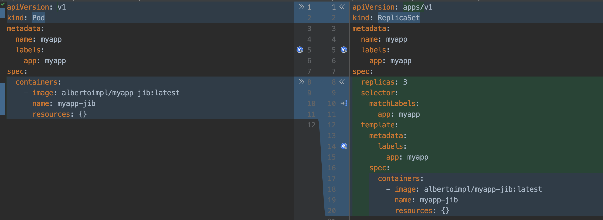
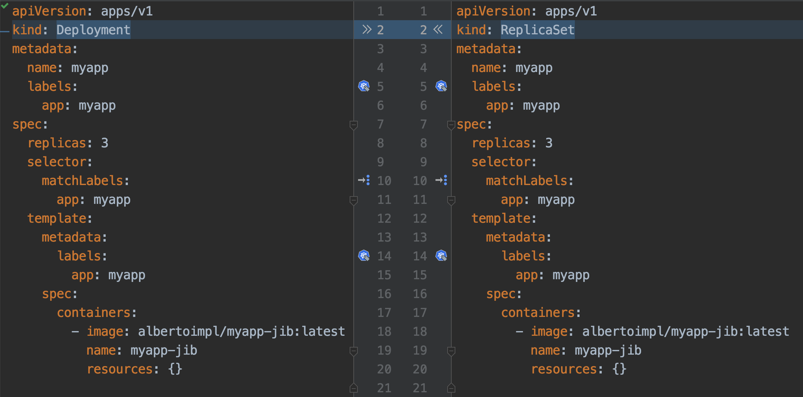
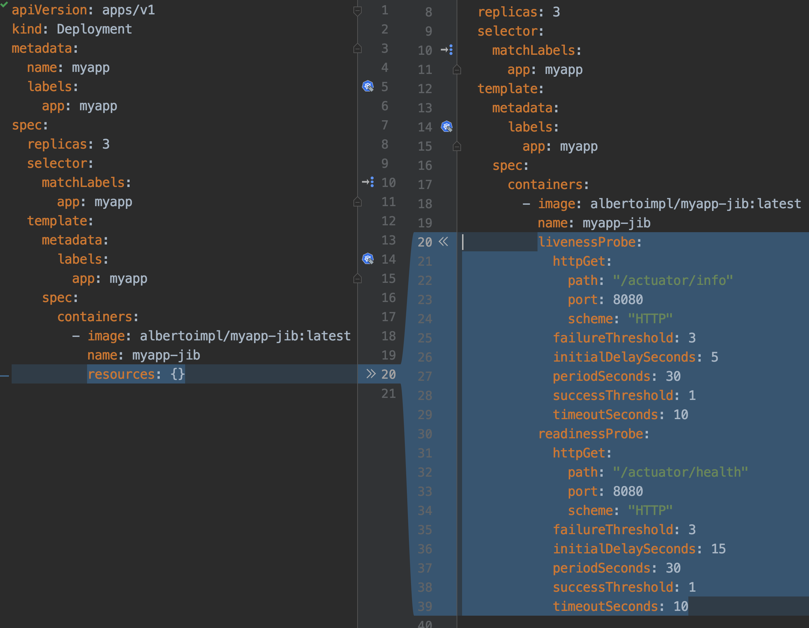

= K8s basics

== Local environment

kubectl

If you want to be a 7x developer and don't want to learn how to pronounce this tool name, just:

```
alias k='kubectl'
```

=== KIND

Kubernetes IN Docker

KIND is a tool for running local Kubernetes clusters using Docker containers as nodes.
Easier to start and delete. Takes about 20 seconds to spin a new cluster.


```
kind create cluster
```

```
Creating cluster "kind" ...
 ✓ Ensuring node image (kindest/node:v1.15.3) 🖼
 ✓ Preparing nodes 📦
 ✓ Creating kubeadm config 📜
 ✓ Starting control-plane 🕹️
 ✓ Installing CNI 🔌
 ✓ Installing StorageClass 💾
Cluster creation complete. You can now use the cluster with:

export KUBECONFIG="$(kind get kubeconfig-path --name="kind")"
kubectl cluster-info
```

```
k cluster-info
Kubernetes master is running at https://127.0.0.1:60694
KubeDNS is running at https://127.0.0.1:60694/api/v1/namespaces/kube-system/services/kube-dns:dns/proxy

To further debug and diagnose cluster problems, use 'kubectl cluster-info dump'.
```

If you can use a real development cluster hosted in the cloud, just use it.

== Pod

Smallest deployable unit is a pod. Literally, a Pod is a group of whales.

Typically, we will have a one to one app to pod.
If you have a frontend, a backend and a database, you don't want to scale them the same way so they will very likely live in different pods.

The cloud code IntelliJ IDEA plugin helps a lot:
https://plugins.jetbrains.com/plugin/8079-cloud-code/

We are going to be focusing on the important things for us right now: the pod name, the image name and the label.

```
apiVersion: v1
kind: Pod
metadata:
  labels:
    app: myapp
  name: myapp
spec:
  containers:
    - image: albertoimpl/myapp-jib:latest
      name: myapp-jib
      resources: {}
```

Congratulations, you are one step closer to becoming a YAML engineer!

```
k apply -f pod.yml
pod/myapp created
```

```
k get pods
NAME    READY   STATUS             RESTARTS   AGE
myapp   0/1     ImagePullBackOff   0          1m
```

```
k get pods
NAME    READY   STATUS    RESTARTS   AGE
myapp   1/1     Running   0          1m
```

We can get more information about the whole process with describe
```
k describe pod myapp

Name:               myapp
Namespace:          default
Priority:           0
PriorityClassName:  <none>
Node:               kind-control-plane/172.17.0.2
Start Time:         Sat, 12 Oct 2019 14:59:44 -0500
Labels:             app=myapp
Annotations:        kubectl.kubernetes.io/last-applied-configuration:
                      {"apiVersion":"v1","kind":"Pod","metadata":{"annotations":{},"labels":{"app":"myapp"},"name":"myapp","namespace":"default"},"spec":{"conta...
Status:             Running
IP:                 10.244.0.4
```

But if we try to curl, it will timeout and it is because by default our pods can't be accessed outside from the outside world.

Kubernetes Pods are mortal. They are born and when they die, they are not resurrected.

== Service

For us to access our pod, we need to create a service.
A service is an abstraction which defines a set of Pods and a policy to access them

The main types are:
`ClusterIP`: Exposes only inside the cluster. This is the default ServiceType.

`NodePort`: Exposes a port through the node to the world.

`LoadBalancer`: Exposes the Service externally using a cloud provider’s load balancer.


Remember that we had that label in our pod definition?
This is how binding works in k8s, this selector is going to select all pods where the key matches the value.

```
apiVersion: v1
kind: Service
metadata:
  name: service-myapp-jib
spec:
  selector:
    app: myapp
  ports:
    - protocol: TCP
      port: 8080
      targetPort: 8080
  type: NodePort
```

```
k apply -f service.yml
service/service-myapp-jib created
```

```
k get services
NAME                TYPE           CLUSTER-IP       EXTERNAL-IP   PORT(S)          AGE
kubernetes          ClusterIP      10.96.0.1        <none>        443/TCP          92m
service-myapp-jib   NodePort       10.111.36.24     <none>        8080:31106/TCP   6s
```

```
k port-forward service/service-myapp-jib 8080:8080
Forwarding from 127.0.0.1:8080 -> 8080
Forwarding from [::1]:8080 -> 8080
```

```
curl localhost:8080
Hello, All
```

== ReplicaSets

If we deploy pods ourselves we are responsible for its lifecycle.
If our pod dies for whatever reason it will be dead until we act on it.

ReplicaSets are used to maintain the number and running state of pods.
You can also configure the ReplicaSet to autoscale based on the amount of CPU load the node is experiencing.

```
apiVersion: apps/v1
kind: ReplicaSet
metadata:
  name: myapp
  labels:
    app: myapp
spec:
  replicas: 3
  selector:
    matchLabels:
      app: myapp
  template:
    metadata:
      labels:
        app: myapp
    spec:
      containers:
        - image: albertoimpl/myapp-jib:latest
          name: myapp-jib
          resources: {}
```

If we take a closer look to the diff we can see how the Replicaset object contains a pod object.



```
k apply -f replicaset.yml
replicaset.apps/myapp created
```

Usually, we will get more than one kind of object:

```
k get po,svc,rs
NAME              READY   STATUS    RESTARTS   AGE
pod/myapp         1/1     Running   0          101m
pod/myapp-lbb82   1/1     Running   0          43s
pod/myapp-m82tv   1/1     Running   0          43s

NAME                        TYPE        CLUSTER-IP     EXTERNAL-IP   PORT(S)          AGE
service/kubernetes          ClusterIP   10.96.0.1      <none>        443/TCP          120m
service/service-myapp-jib   NodePort    10.111.36.24   <none>        8080:31106/TCP   16m

NAME                          DESIRED   CURRENT   READY   AGE
replicaset.extensions/myapp   3         3         3       43s
```
We saw that we have the two missing pods and the old one we created before.
Let's see what happens if we delete it:

```
k delete pod/myapp
pod "myapp" deleted
```

It will automatically create a new one for us:

```
 k get po,svc,rs
NAME              READY   STATUS    RESTARTS   AGE
pod/myapp-l5tfq   1/1     Running   0          18s
pod/myapp-lbb82   1/1     Running   0          4m35s
pod/myapp-m82tv   1/1     Running   0          4m35s

NAME                        TYPE        CLUSTER-IP     EXTERNAL-IP   PORT(S)          AGE
service/kubernetes          ClusterIP   10.96.0.1      <none>        443/TCP          124m
service/service-myapp-jib   NodePort    10.111.36.24   <none>        8080:31106/TCP   20m

NAME                          DESIRED   CURRENT   READY   AGE
replicaset.extensions/myapp   3         3         3       4m35s
```

== Deployment

The abstraction that is typically used is a Deployment.
It contains all the Replicaset provided to us and also ensures that any update we make to our pods does not cause downtime.
It supports rollover updates and rollbacks.

To move from a Replicaset to a Deployment we have to do a massive work:



```
apiVersion: apps/v1
kind: Deployment
metadata:
  name: myapp
  labels:
    app: myapp
spec:
  replicas: 3
  selector:
    matchLabels:
      app: myapp
  template:
    metadata:
      labels:
        app: myapp
    spec:
      containers:
        - image: albertoimpl/myapp-jib:latest
          name: myapp-jib
          resources: {}
```

If we apply and check:

```
k apply -f deployment.yml
deployment.apps/myapp created
```

```
k get po,svc,rs,deployments
NAME              READY   STATUS    RESTARTS   AGE
pod/myapp-l5tfq   1/1     Running   0          4m11s
pod/myapp-lbb82   1/1     Running   0          8m28s
pod/myapp-m82tv   1/1     Running   0          8m28s

NAME                        TYPE        CLUSTER-IP     EXTERNAL-IP   PORT(S)          AGE
service/kubernetes          ClusterIP   10.96.0.1      <none>        443/TCP          128m
service/service-myapp-jib   NodePort    10.111.36.24   <none>        8080:31106/TCP   24m

NAME                          DESIRED   CURRENT   READY   AGE
replicaset.extensions/myapp   3         3         3       8m28s

NAME                          READY   UP-TO-DATE   AVAILABLE   AGE
deployment.extensions/myapp   3/3     3            3           2s
```

We came a long way but now we have all these amazing capabilities.

But there are a couple of ways to get all this YAML generated for us.

The easier one:

```
k create deployment myapp --image=dockerhub.com/albertoimpl/myapp-jib --dry-run -oyaml
```

Will output almost the same we have in our `deployment.yml`

== Dekorate

If like me, you have YAML with your all your soul there is an alternative.

Dekorate helps with generating Kubernetes manifests as easy as adding a dependency to the classpath:

```
	compile 'io.dekorate:kubernetes-spring-starter:0.9.2'
	annotationProcessor 'io.dekorate:kubernetes-annotations:0.9.2'
```

and adding an annotation `@KubernetesApplication` to our main class.

We can now update our manifest by adding annotations or by adding some more YAML:

```
dekorate:
  kubernetes:
    labels:
      - app: myapp
    ports:
      - protocol: TCP
        port: 8080
        targetPort: 8080
    serviceType: NodePort
    group: albertoimpl
```

I would personally go with generating the YAML with a dry-run the first time and then update it manually since I found myself going back and forward trying to match what I need to what the tool generates.

== Probes

When our application starts to grow, having the container started does not mean that we are ready to accept traffic.
Kubernetes provides Probes to help us with this. Probes will periodically perform an action to confirm that the application is working, but leaving it to the default can lead to terrible consequences.

Kubernetes uses a Liveness Probes to know when to restart a container.
Kubernetes uses a Readiness Probes to know when to start accepting traffic.
A Pod is ready when all of its containers are ready.

The main mistakes are:
Having no probes, since will make the container available when it should not
Making Liveness dependent on an external check, like other services or databases can cause a restart of all your containers when just a single external failure occurs.


What should be set them to?
`livenessProbe` to `actuator/info` or just create an endpoint that returns OK
`readinessProbe` is perfect for Spring `actuator/health`

There are other values that you should set, but that will depend on your application.



Or if you are using Dekorate:

```
@KubernetesApplication(
livenessProbe = @Probe(httpActionPath = "/actuator/info"),
readinessProbe = @Probe(httpActionPath = "/actuator/health"))
```

If you know your application takes longer than that to start, since Kubernetes 2.16 there is a new type of probe called `startupProbe` that will help you with the warm up.

```
startupProbe:
  httpGet:
    path: /healthz
    port: liveness-port
  failureThreshold: 30
  periodSeconds: 10
```
