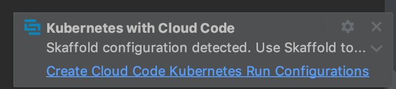
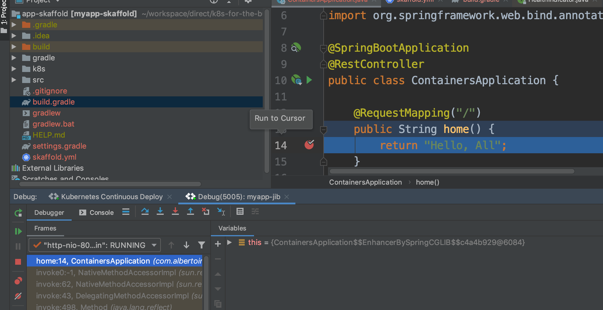

=== Local Development Workflow

Now that we know how to properly create an application, containarize it and deploy it to Kubernetes it's time for us to extend it.
If we want to iterate over our app the manual way we have to go, execute jib, then kubectl apply again and so on.
We are going to introduce a couple of tools to help us with that.

==== Skaffold

Automatically detects changes, compile your application and deploys it for you.
The tool integrates with well jib and the IntelliJ Cloud Code plugin which makes it key for a great developer experience.



In order to use it we need to add a new file called `skaffold.yml` and move our Deployment and Service YAML files to a folder called `k8s`.

```
apiVersion: skaffold/v1beta15
kind: Config
build:
  artifacts:
    - image: albertoimpl/myapp-jib
      jib: {}
```

With that configured we can run it from the command line or through the IDE.
You can even debug and add a breakpoint to your code:



=== Kustomize

Now that we have the ability to iterate over our app, we are going to show how to customize it for different environments:
Kustomize lets you customize raw, template-free YAML files for multiple purposes, leaving the original YAML untouched and usable as is.

```
touch kustomization.yaml
kustomize edit add resource service.yaml
kustomize edit add resource deployment.yaml
```

will generate:

```
apiVersion: kustomize.config.k8s.io/v1beta1
kind: Kustomization
resources:
- k8s/deployment.yaml
- k8s/service.yaml
```

You can have profiles within Skaffold but we found that using Kustomize to represent them was a better approach that we can reuse to generate our real production deployment by using variants and overlays.

A variant is the outcome, in a cluster, of applying an overlay to a base.

For that, we have to change our file structure a bit.
We will have our original deployment and service, altogether with a new kustomization.yaml file:

```kustomization.yaml
apiVersion: kustomize.config.k8s.io/v1beta1
kind: Kustomization
resources:
  - deployment.yaml
  - service.yaml

```

Then, we are going to create overlays for development and for production:

```kustomization.yaml
resources:
  - ../../base
patchesStrategicMerge:
  - replicas.yaml
namePrefix: development-
```

We will decrease the number of replicas to 1 in our development environment:

```replicas.yaml
apiVersion: apps/v1
kind: Deployment
metadata:
  namespace: default
  name: myapp
spec:
  replicas: 1
```

And increase it to 5 in our production one:

```replicas.yaml
apiVersion: apps/v1
kind: Deployment
metadata:
  namespace: default
  name: myapp
spec:
  replicas: 5
```

This is the final structure:

```
~/app-kustomize
├── base
│   ├── deployment.yaml
│   ├── service.yaml
│   └── kustomization.yaml
└── overlays
    ├── development
    │   ├── kustomization.yaml
    │   ├── profiles.yaml
    │   └── replicas.yaml
    └── production
        ├── kustomization.yaml
        ├── profiles.yaml
        └── replicas.yaml
```

With overlays we can also provide different configurations depending on the environment.

For us get our development overlay:

```
kustomize build overlays/development
```

And for production just:

```
kustomize build overlays/production
```

We can commit and version those files or just apply them as part of the deployment process:

```
kustomize build overlays/production | kubectl apply -f -
```

=== Okteto

The is my typical workflow, but I found a tool recently that looks very interesting to test some cases.
It is called Okteto and it helps us with the automatic hot reloads of the project.

By adding `spring-boot-devtools` to our app:

```
	compile 'org.springframework.boot:spring-boot-devtools'
```

```
 k apply -f k8s/deployment.yaml
deployment.apps/myapp configured
```

```
 curl https://get.okteto.com -sSfL | sh
> Installing /usr/local/bin/okteto
  % Total    % Received % Xferd  Average Speed   Time    Time     Time  Current
                                 Dload  Upload   Total   Spent    Left  Speed
100   143    0   143    0     0    117      0 --:--:--  0:00:01 --:--:--   118
100   611    0   611    0     0    349      0 --:--:--  0:00:01 --:--:--   349
100 46.9M  100 46.9M    0     0  1079k      0  0:00:44  0:00:44 --:--:-- 1213k
> Okteto successfully installed!
```

```
okteto init
Recommended image for development with Java: okteto/gradle:latest
Which docker image do you want to use for your development environment? [okteto/gradle:latest]: okteto/gradle:latest

 ✓  Okteto manifest (okteto.yml) created
```

Note that this has to be done in a real cluster, KIND is not supported yet.

```
okteto up
Deployment app-okteto doesn't exist in namespace default. Do you want to create a new one? [y/n]: y
 ✓  Development environment activated
 ✓  Files synchronized
    Namespace: default
    Name:      app-okteto
    Forward:   8080 -> 8080
               8088 -> 8088
root@app-okteto-7468b9849b-rdsl5:/okteto#
```

It creates an environment with our current working directory

```
root@app-okteto-7468b9849b-rdsl5:/okteto# ls
build.gradle  deployment.yaml  gradle  gradlew  gradlew.bat  HELP.md  okteto.yml  service.yaml  settings.gradle  src
```

```
k get all
NAME                              READY   STATUS    RESTARTS   AGE
pod/app-okteto-7468b9849b-rdsl5   1/1     Running   0          2m15s
pod/myapp-5855864f54-6d75k        1/1     Running   0          2m42s

NAME                 TYPE        CLUSTER-IP    EXTERNAL-IP   PORT(S)    AGE
service/app-okteto   ClusterIP   10.118.5.98   <none>        8080/TCP   2m16s
service/kubernetes   ClusterIP   10.118.0.1    <none>        443/TCP    11m

NAME                         READY   UP-TO-DATE   AVAILABLE   AGE
deployment.apps/app-okteto   1/1     1            1           2m16s
deployment.apps/myapp        1/1     1            1           2m43s

NAME                                    DESIRED   CURRENT   READY   AGE
replicaset.apps/app-okteto-7468b9849b   1         1         1       2m16s
replicaset.apps/myapp-5855864f54        1         1         1       2m43s
```

```
root@app-okteto-56b998d9f6-m76p5:/okteto# gradle bootRun
Listening for transport dt_socket at address: 8088

> Task :bootRun
> :compileJava > Resolve dependencies of :compileClasspath > Resolve files of :detachedConfiguration6
  .   ____          _            __ _ _
 /\\ / ___'_ __ _ _(_)_ __  __ _ \ \ \ \
( ( )\___ | '_ | '_| | '_ \/ _` | \ \ \ \
 \\/  ___)| |_)| | | | | || (_| |  ) ) ) )
  '  |____| .__|_| |_|_| |_\__, | / / / /
 =========|_|==============|___/=/_/_/_/
 :: Spring Boot ::        (v2.1.8.RELEASE)

2019-10-29 09:07:47.642  INFO 257 --- [  restartedMain] c.a.d.containers.ContainersApplication   : Starting ContainersApplication on app-okteto-56b998d9f6-m76p5 with PID 257 (/okteto/build/classes/java/main started by root in /okteto)
2019-10-29 09:07:47.655  INFO 257 --- [  restartedMain] c.a.d.containers.ContainersApplication   : No active profile set, falling back to default profiles: default
2019-10-29 09:07:47.839  INFO 257 --- [  restartedMain] .e.DevToolsPropertyDefaultsPostProcessor : Devtools property defaults active! Set 'spring.devtools.add-properties' to 'false' to disable
2019-10-29 09:07:47.840  INFO 257 --- [  restartedMain] .e.DevToolsPropertyDefaultsPostProcessor : For additional web related logging consider setting the 'logging.level.web' property to 'DEBUG'
2019-10-29 09:07:51.737  INFO 257 --- [  restartedMain] o.s.b.w.embedded.tomcat.TomcatWebServer  : Tomcat initialized with port(s): 8080 (http)
2019-10-29 09:07:51.819  INFO 257 --- [  restartedMain] o.apache.catalina.core.StandardService   : Starting service [Tomcat]
2019-10-29 09:07:51.829  INFO 257 --- [  restartedMain] org.apache.catalina.core.StandardEngine  : Starting Servlet engine: [Apache Tomcat/9.0.24]
2019-10-29 09:07:52.052  INFO 257 --- [  restartedMain] o.a.c.c.C.[Tomcat].[localhost].[/]       : Initializing Spring embedded WebApplicationContext
2019-10-29 09:07:52.056  INFO 257 --- [  restartedMain] o.s.web.context.ContextLoader            : Root WebApplicationContext: initialization completed in 4216 ms
2019-10-29 09:07:53.471  INFO 257 --- [  restartedMain] o.s.s.concurrent.ThreadPoolTaskExecutor  : Initializing ExecutorService 'applicationTaskExecutor'
2019-10-29 09:07:54.142  INFO 257 --- [  restartedMain] o.s.b.d.a.OptionalLiveReloadServer       : LiveReload server is running on port 35729
2019-10-29 09:07:54.161  INFO 257 --- [  restartedMain] o.s.b.a.e.web.EndpointLinksResolver      : Exposing 2 endpoint(s) beneath base path '/actuator'
2019-10-29 09:07:54.359  INFO 257 --- [  restartedMain] o.s.b.w.embedded.tomcat.TomcatWebServer  : Tomcat started on port(s): 8080 (http) with context path ''
2019-10-29 09:07:54.373  INFO 257 --- [  restartedMain] c.a.d.containers.ContainersApplication   : Started ContainersApplication in 7.742 seconds (JVM running for 8.586)
```

Note the:

```
 LiveReload server is running on port 35729
```

```
curl localhost:8080/hello
Hello, world
```

```
@RequestMapping("/hello")
public String hello() {
    return "Hello, live!";
}
```

```
curl localhost:8080/hello
Hello, live
```

More info in: https://okteto.com/blog/how-to-develop-java-apps-in-kubernetes/
