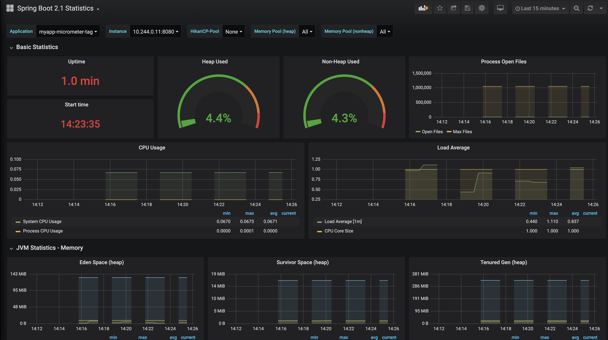

=== Logs aggregation

We have seen that we can stream our logs locally with Skaffold, and now we are going to show how to do it remotely:

==== Logs from one pod

If there is a problem with our app.
If we have one app, getting the logs is easy:

```
k logs pod/myapp-55bbf4947c-4l6lq

  .   ____          _            __ _ _
 /\\ / ___'_ __ _ _(_)_ __  __ _ \ \ \ \
( ( )\___ | '_ | '_| | '_ \/ _` | \ \ \ \
 \\/  ___)| |_)| | | | | || (_| |  ) ) ) )
  '  |____| .__|_| |_|_| |_\__, | / / / /
 =========|_|==============|___/=/_/_/_/
 :: Spring Boot ::        (v2.1.8.RELEASE)

2019-10-18 08:06:19.095  INFO 1 --- [           main] c.a.d.containers.ContainersApplication   : Starting ContainersApplication on myapp-55bbf4947c-4l6lq with PID 1 (/app/classes started by root in /)
2019-10-18 08:06:19.107  INFO 1 --- [           main] c.a.d.containers.ContainersApplication   : No active profile set, falling back to default profiles: default
2019-10-18 08:06:25.271  INFO 1 --- [           main] o.s.b.w.embedded.tomcat.TomcatWebServer  : Tomcat initialized with port(s): 8080 (http)
2019-10-18 08:06:25.501  INFO 1 --- [           main] o.apache.catalina.core.StandardService   : Starting service [Tomcat]
2019-10-18 08:06:25.512  INFO 1 --- [           main] org.apache.catalina.core.StandardEngine  : Starting Servlet engine: [Apache Tomcat/9.0.24]
2019-10-18 08:06:25.927  INFO 1 --- [           main] o.a.c.c.C.[Tomcat].[localhost].[/]       : Initializing Spring embedded WebApplicationContext
2019-10-18 08:06:25.929  INFO 1 --- [           main] o.s.web.context.ContextLoader            : Root WebApplicationContext: initialization completed in 6619 ms
2019-10-18 08:06:28.278  INFO 1 --- [           main] o.s.s.concurrent.ThreadPoolTaskExecutor  : Initializing ExecutorService 'applicationTaskExecutor'
2019-10-18 08:06:29.422  INFO 1 --- [           main] o.s.b.a.e.web.EndpointLinksResolver      : Exposing 2 endpoint(s) beneath base path '/actuator'
2019-10-18 08:06:29.753  INFO 1 --- [           main] o.s.b.w.embedded.tomcat.TomcatWebServer  : Tomcat started on port(s): 8080 (http) with context path ''
2019-10-18 08:06:29.784  INFO 1 --- [           main] c.a.d.containers.ContainersApplication   : Started ContainersApplication in 12.49 seconds (JVM running for 13.595)
2019-10-18 08:06:50.637  INFO 1 --- [nio-8080-exec-1] o.a.c.c.C.[Tomcat].[localhost].[/]       : Initializing Spring DispatcherServlet 'dispatcherServlet'
2019-10-18 08:06:50.638  INFO 1 --- [nio-8080-exec-1] o.s.web.servlet.DispatcherServlet        : Initializing Servlet 'dispatcherServlet'
2019-10-18 08:06:50.655  INFO 1 --- [nio-8080-exec-1] o.s.web.servlet.DispatcherServlet        : Completed initialization in 17 ms
```

==== Logs from all the pods

However, we are in a microservices world, we could have 10 instances.
What are the odds of us hitting the right pod?

For that I use a tool called stern, you can just brew install it and it will print the logs for each instance in a different color.

```
stern myapp
+ myapp-55bbf4947c-57dcn › myapp-jib
+ myapp-55bbf4947c-4l6lq › myapp-jib
+ myapp-55bbf4947c-8v8c8 › myapp-jib
myapp-55bbf4947c-8v8c8 myapp-jib
myapp-55bbf4947c-8v8c8 myapp-jib   .   ____          _            __ _ _
myapp-55bbf4947c-8v8c8 myapp-jib  /\\ / ___'_ __ _ _(_)_ __  __ _ \ \ \ \
myapp-55bbf4947c-8v8c8 myapp-jib ( ( )\___ | '_ | '_| | '_ \/ _` | \ \ \ \
myapp-55bbf4947c-8v8c8 myapp-jib  \\/  ___)| |_)| | | | | || (_| |  ) ) ) )
myapp-55bbf4947c-8v8c8 myapp-jib   '  |____| .__|_| |_|_| |_\__, | / / / /
myapp-55bbf4947c-8v8c8 myapp-jib  =========|_|==============|___/=/_/_/_/
myapp-55bbf4947c-8v8c8 myapp-jib  :: Spring Boot ::        (v2.1.8.RELEASE)
myapp-55bbf4947c-8v8c8 myapp-jib
myapp-55bbf4947c-8v8c8 myapp-jib 2019-10-18 08:06:18.696  INFO 1 --- [           main] c.a.d.containers.ContainersApplication   : Starting ContainersApplication on myapp-55bbf4947c-8v8c8 with PID 1 (/app/classes started by root in /)
myapp-55bbf4947c-8v8c8 myapp-jib 2019-10-18 08:06:18.740  INFO 1 --- [           main] c.a.d.containers.ContainersApplication   : No active profile set, falling back to default profiles: default
myapp-55bbf4947c-8v8c8 myapp-jib 2019-10-18 08:06:25.395  INFO 1 --- [           main] o.s.b.w.embedded.tomcat.TomcatWebServer  : Tomcat initialized with port(s): 8080 (http)
myapp-55bbf4947c-8v8c8 myapp-jib 2019-10-18 08:06:25.528  INFO 1 --- [           main] o.apache.catalina.core.StandardService   : Starting service [Tomcat]
myapp-55bbf4947c-8v8c8 myapp-jib 2019-10-18 08:06:25.529  INFO 1 --- [           main] org.apache.catalina.core.StandardEngine  : Starting Servlet engine: [Apache Tomcat/9.0.24]
myapp-55bbf4947c-8v8c8 myapp-jib 2019-10-18 08:06:25.905  INFO 1 --- [           main] o.a.c.c.C.[Tomcat].[localhost].[/]       : Initializing Spring embedded WebApplicationContext
myapp-55bbf4947c-8v8c8 myapp-jib 2019-10-18 08:06:25.905  INFO 1 --- [           main] o.s.web.context.ContextLoader            : Root WebApplicationContext: initialization completed in 6899 ms
myapp-55bbf4947c-8v8c8 myapp-jib 2019-10-18 08:06:28.521  INFO 1 --- [           main] o.s.s.concurrent.ThreadPoolTaskExecutor  : Initializing ExecutorService 'applicationTaskExecutor'
myapp-55bbf4947c-8v8c8 myapp-jib 2019-10-18 08:06:29.709  INFO 1 --- [           main] o.s.b.a.e.web.EndpointLinksResolver      : Exposing 2 endpoint(s) beneath base path '/actuator'
myapp-55bbf4947c-8v8c8 myapp-jib 2019-10-18 08:06:29.914  INFO 1 --- [           main] o.s.b.w.embedded.tomcat.TomcatWebServer  : Tomcat started on port(s): 8080 (http) with context path ''
myapp-55bbf4947c-8v8c8 myapp-jib 2019-10-18 08:06:29.927  INFO 1 --- [           main] c.a.d.containers.ContainersApplication   : Started ContainersApplication in 13.075 seconds (JVM running for 13.977)
myapp-55bbf4947c-8v8c8 myapp-jib 2019-10-18 08:06:44.055  INFO 1 --- [nio-8080-exec-1] o.a.c.c.C.[Tomcat].[localhost].[/]       : Initializing Spring DispatcherServlet 'dispatcherServlet'
myapp-55bbf4947c-8v8c8 myapp-jib 2019-10-18 08:06:44.055  INFO 1 --- [nio-8080-exec-1] o.s.web.servlet.DispatcherServlet        : Initializing Servlet 'dispatcherServlet'
myapp-55bbf4947c-8v8c8 myapp-jib 2019-10-18 08:06:44.068  INFO 1 --- [nio-8080-exec-1] o.s.web.servlet.DispatcherServlet        : Completed initialization in 13 ms
myapp-55bbf4947c-57dcn myapp-jib
myapp-55bbf4947c-57dcn myapp-jib   .   ____          _            __ _ _
myapp-55bbf4947c-57dcn myapp-jib  /\\ / ___'_ __ _ _(_)_ __  __ _ \ \ \ \
myapp-55bbf4947c-57dcn myapp-jib ( ( )\___ | '_ | '_| | '_ \/ _` | \ \ \ \
myapp-55bbf4947c-57dcn myapp-jib  \\/  ___)| |_)| | | | | || (_| |  ) ) ) )
myapp-55bbf4947c-57dcn myapp-jib   '  |____| .__|_| |_|_| |_\__, | / / / /
myapp-55bbf4947c-57dcn myapp-jib  =========|_|==============|___/=/_/_/_/
myapp-55bbf4947c-4l6lq myapp-55bbf4947c-57dcn myapp-jib
```

==== Logs using EFK stack

This is a great tool but in a real system you will most likely have loads of logs from different systems and we need better tooling.

If you are on GKE you have Stackdriver already there for you.
If you aren't the most common solution has been the EFK stack .

Stands for the name of three projects: Elasticsearch, Logstash, and Kibana.
Elasticsearch is a search and analytics engine.
Logstash is a server‑side data processing pipeline and then sends it to a "stash" like Elasticsearch.
Kibana lets users visualize data with charts and graphs in Elasticsearch.

Inside the official kubernetes repo there are all the files you need to install it: https://github.com/kubernetes/kubernetes/tree/master/cluster/addons/fluentd-elasticsearch

Be aware that the logs files will disappear if the container restarts, since this is maintained for testing purposes not for production.

We are not going to go on details on how this is operated but for testing you can just download those files and do a:

But all we have to do to see our logs locally was to update the `kibana-deployment.yaml` to delete the `SERVER_BASEPATH` property and we can apply it now:

```
k apply -f .
service/elasticsearch-logging created
serviceaccount/elasticsearch-logging created
clusterrole.rbac.authorization.k8s.io/elasticsearch-logging created
clusterrolebinding.rbac.authorization.k8s.io/elasticsearch-logging created
statefulset.apps/elasticsearch-logging created
configmap/fluentd-es-config-v0.2.0 created
serviceaccount/fluentd-es created
clusterrole.rbac.authorization.k8s.io/fluentd-es created
clusterrolebinding.rbac.authorization.k8s.io/fluentd-es created
daemonset.apps/fluentd-es-v2.7.0 created
deployment.apps/kibana-logging created
service/kibana-logging created
```

After that, we will see how new elements start to appear in the kube-system namespace:

```
k get all --all-namespaces=true
NAMESPACE     NAME                                             READY   STATUS    RESTARTS   AGE
default       pod/myapp-55bbf4947c-4l6lq                       1/1     Running   0          26m
default       pod/myapp-55bbf4947c-57dcn                       1/1     Running   0          26m
default       pod/myapp-55bbf4947c-8v8c8                       1/1     Running   0          26m
kube-system   pod/coredns-5c98db65d4-7gw54                     1/1     Running   0          5d12h
kube-system   pod/coredns-5c98db65d4-hq694                     1/1     Running   0          5d12h
kube-system   pod/elasticsearch-logging-0                      1/1     Running   0          2m43s
kube-system   pod/elasticsearch-logging-1                      1/1     Running   0          72s
kube-system   pod/etcd-kind-control-plane                      1/1     Running   0          5d12h
kube-system   pod/fluentd-es-v2.7.0-xlxvx                      1/1     Running   0          2m43s
kube-system   pod/kibana-logging-7b97c764f6-v9hd2              1/1     Running   1          2m43s
kube-system   pod/kindnet-jxsjj                                1/1     Running   1          5d12h
kube-system   pod/kube-apiserver-kind-control-plane            1/1     Running   0          5d12h
kube-system   pod/kube-controller-manager-kind-control-plane   1/1     Running   0          5d12h
kube-system   pod/kube-proxy-bsdr8                             1/1     Running   0          5d12h
kube-system   pod/kube-scheduler-kind-control-plane            1/1     Running   0          5d12h

NAMESPACE     NAME                            TYPE        CLUSTER-IP      EXTERNAL-IP   PORT(S)                  AGE
default       service/kubernetes              ClusterIP   10.96.0.1       <none>        443/TCP                  5d12h
default       service/service-myapp-jib       NodePort    10.106.15.113   <none>        8080:30738/TCP           26m
kube-system   service/elasticsearch-logging   ClusterIP   10.111.43.40    <none>        9200/TCP                 2m44s
kube-system   service/kibana-logging          ClusterIP   10.100.128.97   <none>        5601/TCP                 2m43s
kube-system   service/kube-dns                ClusterIP   10.96.0.10      <none>        53/UDP,53/TCP,9153/TCP   5d12h

NAMESPACE     NAME                               DESIRED   CURRENT   READY   UP-TO-DATE   AVAILABLE   NODE SELECTOR                 AGE
kube-system   daemonset.apps/fluentd-es-v2.7.0   1         1         1       1            1           <none>                        2m43s
kube-system   daemonset.apps/kindnet             1         1         1       1            1           <none>                        5d12h
kube-system   daemonset.apps/kube-proxy          1         1         1       1            1           beta.kubernetes.io/os=linux   5d12h

NAMESPACE     NAME                             READY   UP-TO-DATE   AVAILABLE   AGE
default       deployment.apps/myapp            3/3     3            3           26m
kube-system   deployment.apps/coredns          2/2     2            2           5d12h
kube-system   deployment.apps/kibana-logging   1/1     1            1           2m43s

NAMESPACE     NAME                                        DESIRED   CURRENT   READY   AGE
default       replicaset.apps/myapp-55bbf4947c            3         3         3       26m
kube-system   replicaset.apps/coredns-5c98db65d4          2         2         2       5d12h
kube-system   replicaset.apps/kibana-logging-7b97c764f6   1         1         1       2m43s

NAMESPACE     NAME                                     READY   AGE
kube-system   statefulset.apps/elasticsearch-logging   2/2     2m43s
```

In order for us to access the UI we can port-forward the kibana-logging port:

```
k port-forward service/kibana-logging 5601:5601 --namespace=kube-system
```

And we can now access: http://127.0.0.1:5601/app/kibana

I deleted one of our my-app pods to get some more log data and we can see it:


The easier way to filter is by namespace:

```
namespace=default
```

And an important thing to note is that we do not want to write our logs to filesystem but to System.out.

=== Metrics

Logging are a recording from events but that is usually not enough.
Specially if we want to have alerting in our system.
For that we will use metrics, which represent data combined from measuring events.

We are going to extend our app and install a couple of tools called prometheus and grafana:

To install them, we need to execute the following commands:

```
brew install kubernetes-helm
helm init --history-max 200

k --namespace kube-system create serviceaccount tiller
k create clusterrolebinding tiller --clusterrole cluster-admin --serviceaccount=kube-system:tiller
helm init --service-account tiller --upgrade

helm install --name prometheus stable/prometheus-operator
```

we have now everything installed:

```
k get all
NAME                                                         READY   STATUS    RESTARTS   AGE
pod/alertmanager-prometheus-prometheus-oper-alertmanager-0   2/2     Running   0          84s
pod/myapp-55bbf4947c-57dcn                                   1/1     Running   0          150m
pod/myapp-55bbf4947c-8v8c8                                   1/1     Running   0          150m
pod/myapp-55bbf4947c-9j2ns                                   1/1     Running   0          73m
pod/prometheus-grafana-85967c9fdd-bj5rq                      2/2     Running   0          100s
pod/prometheus-kube-state-metrics-57d6c55b56-47bfj           1/1     Running   0          100s
pod/prometheus-prometheus-node-exporter-x7kj4                1/1     Running   0          100s
pod/prometheus-prometheus-oper-operator-d5b6b8494-vhfs6      2/2     Running   0          100s
pod/prometheus-prometheus-prometheus-oper-prometheus-0       3/3     Running   1          73s

NAME                                              TYPE        CLUSTER-IP       EXTERNAL-IP   PORT(S)                      AGE
service/alertmanager-operated                     ClusterIP   None             <none>        9093/TCP,9094/TCP,9094/UDP   85s
service/kubernetes                                ClusterIP   10.96.0.1        <none>        443/TCP                      5d14h
service/prometheus-grafana                        ClusterIP   10.101.196.116   <none>        80/TCP                       101s
service/prometheus-kube-state-metrics             ClusterIP   10.101.149.105   <none>        8080/TCP                     101s
service/prometheus-operated                       ClusterIP   None             <none>        9090/TCP                     73s
service/prometheus-prometheus-node-exporter       ClusterIP   10.98.55.141     <none>        9100/TCP                     100s
service/prometheus-prometheus-oper-alertmanager   ClusterIP   10.101.242.134   <none>        9093/TCP                     100s
service/prometheus-prometheus-oper-operator       ClusterIP   10.98.155.158    <none>        8080/TCP,443/TCP             100s
service/prometheus-prometheus-oper-prometheus     ClusterIP   10.103.200.140   <none>        9090/TCP                     100s
service/service-myapp-jib                         NodePort    10.106.15.113    <none>        8080:30738/TCP               150m

NAME                                                 DESIRED   CURRENT   READY   UP-TO-DATE   AVAILABLE   NODE SELECTOR   AGE
daemonset.apps/prometheus-prometheus-node-exporter   1         1         1       1            1           <none>          100s

NAME                                                  READY   UP-TO-DATE   AVAILABLE   AGE
deployment.apps/myapp                                 3/3     3            3           150m
deployment.apps/prometheus-grafana                    1/1     1            1           100s
deployment.apps/prometheus-kube-state-metrics         1/1     1            1           100s
deployment.apps/prometheus-prometheus-oper-operator   1/1     1            1           100s

NAME                                                            DESIRED   CURRENT   READY   AGE
replicaset.apps/myapp-55bbf4947c                                3         3         3       150m
replicaset.apps/prometheus-grafana-85967c9fdd                   1         1         1       100s
replicaset.apps/prometheus-kube-state-metrics-57d6c55b56        1         1         1       100s
replicaset.apps/prometheus-prometheus-oper-operator-d5b6b8494   1         1         1       100s

NAME                                                                    READY   AGE
statefulset.apps/alertmanager-prometheus-prometheus-oper-alertmanager   1/1     84s
statefulset.apps/prometheus-prometheus-prometheus-oper-prometheus       1/1     73s
```

and after forwarding the port

```
k port-forward service/prometheus-prometheus-oper-prometheus 9090:9090
```

we can access prometheus locally in: http://localhost:9090/graph

but we will be using grafana instead:

```
k port-forward service/prometheus-grafana 9091:80
```

http://localhost:9091/login user and password are by default `admin` and `prom-operator` but you can check in the installation guide how to set them up for production: https://github.com/helm/charts/tree/master/stable/prometheus-operator

All that alone would give us a lot of interesting metrics from our cluster:



However, that usually is not enough and we would like to gather more app-specific metrics.
For that, spring has a project called micrometer that helps us

To enable that, we just have to add a dependency to micrometer:

```
implementation 'org.springframework.boot:spring-boot-starter-actuator'
implementation 'io.micrometer:micrometer-registry-prometheus'
```

And enable a new prometheus endpoint:

```
management:
  endpoints:
    web:
      exposure:
        include: "*"
  endpoint:
    metrics:
      enabled: true
    prometheus:
      enabled: true
```

After this, our app will be exposing prometheus metrics in a new actuator endpoint:

```
curl localhost:8001/actuator/prometheus
# HELP jvm_memory_committed_bytes The amount of memory in bytes that is committed for the Java virtual machine to use
# TYPE jvm_memory_committed_bytes gauge
jvm_memory_committed_bytes{area="heap",id="PS Survivor Space",} 1.2582912E7
jvm_memory_committed_bytes{area="heap",id="PS Old Gen",} 1.22159104E8
jvm_memory_committed_bytes{area="heap",id="PS Eden Space",} 6.3963136E7
jvm_memory_committed_bytes{area="nonheap",id="Metaspace",} 3.997696E7
jvm_memory_committed_bytes{area="nonheap",id="Code Cache",} 8060928.0
jvm_memory_committed_bytes{area="nonheap",id="Compressed Class Space",} 5636096.0
# HELP process_files_max_files The maximum file descriptor count
# TYPE process_files_max_files gauge
process_files_max_files 10240.0
```

For us to enable those metrics, we have to tell prometheus to scrap them:

```
- job_name: 'spring-actuator'
    metrics_path: '/actuator/prometheus'
    scrape_interval: 5s
    static_configs:
    - targets: ['myapp:8080']
```

And we should be seeing them afterwards.


