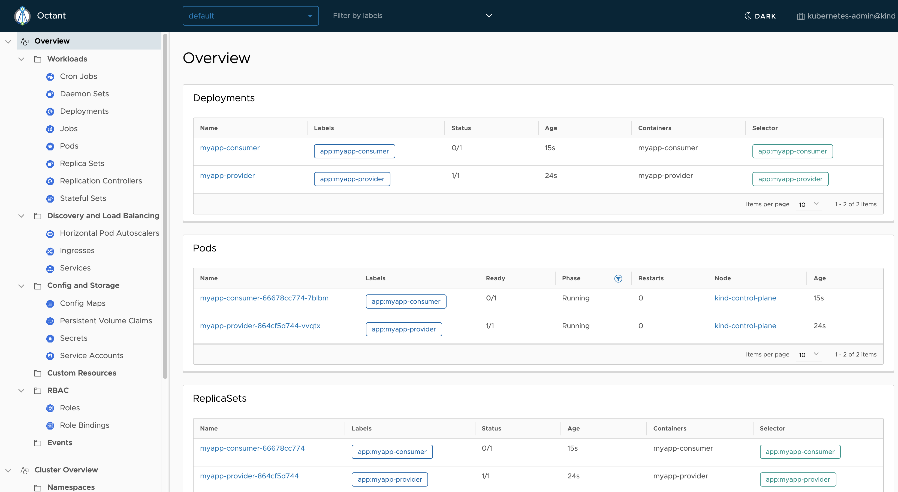

= Visualization

Being able to visualise what you have in your cluster is a nice thing to have.
Specially if it is as easy as it is with Octant.


Octant is a tool for developers to understand how applications run on a Kubernetes cluster.

```
brew install octant
```

And just by running:

```
octant
```

Will open the overview of our cluster:



We can graphically visualise relationships between objects in a Kubernetes cluster.
The status of individual objects are represented by color to show workload performance.

image::octant-deployment.png[Diff]


